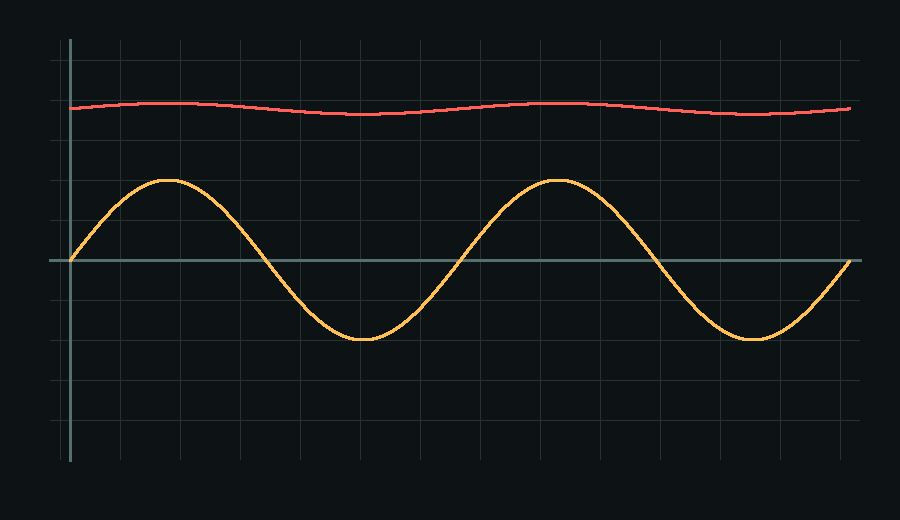

# CircuitSage

**Stack traces for circuits.**

CircuitSage is a local-first Gemma lab buddy for electronics students. Turn it on beside Tinkercad, LTspice, MATLAB, a lab manual, or a bench setup; it watches the shared screen, remembers the session evidence, asks for the next useful measurement, and explains circuit failures without pretending deterministic fallback is an AI answer.



## Quickstart

```bash
make install
make demo
```

`make demo` starts the FastAPI backend, opens `http://localhost:5173`, and runs the Vite dev server. Load the op-amp demo from the home screen or open `/companion` for the always-on screen buddy.

## What Works

- Web Studio for lab sessions, artifacts, measurements, diagnosis, reports, and QR bench handoff.
- Companion mode for screen sharing, snapshot analysis, and workspace-aware help for Tinkercad, LTspice, MATLAB, plots, manuals, and circuit screenshots.
- macOS desktop companion in [apps/desktop](apps/desktop) with an always-on-top window, tray persistence, global shortcut prompt, screen/window picker, voice input, and guarded automation hooks.
- iOS bench companion in [apps/ios](apps/ios) for camera/photo evidence, session attachment, and backend analysis from a physical phone.
- Backend FastAPI tools for SPICE parsing, waveform analysis, measurement comparison, safety checks, fault catalog reasoning, Ollama/Gemma chat, and deterministic fallback.

## Demo Story

The seed demo is an inverting op-amp amplifier:

1. Rin = 10 kOhm and Rf = 47 kOhm.
2. Expected gain is -4.7.
3. Simulation looks correct.
4. Bench output is stuck near +12 V.
5. CircuitSage compares expected vs observed behavior, asks for the non-inverting input voltage, then ranks the floating reference input fault from the catalog.

## Ollama

```bash
ollama serve
ollama pull gemma3:4b
export OLLAMA_MODEL=gemma3:4b
export OLLAMA_BASE_URL=http://localhost:11434
bash scripts/check_ollama.sh
```

If Ollama or the model is unavailable, the UI shows an amber Gemma status banner and the backend returns `gemma_status: deterministic_fallback`.

## Commands

```bash
make install   # backend venv, npm workspaces, optional Ollama pull
make demo      # backend in background, frontend in foreground
make test      # backend pytest, frontend build, desktop check, iOS typecheck
make lint      # ruff when installed, frontend/iOS TypeScript checks
make clean     # remove local env/build artifacts
```

## Tracks

- Future of Education: circuit debugging support for students who do not have one-on-one lab help.
- Digital Equity & Inclusivity: local-first fallback and phone evidence capture for low-resource lab setups.
- Safety: low-voltage educational guidance with refusal paths for mains/high-voltage debugging.

## Build Phases

- Phase 0, hygiene and truthfulness: [docs/WINNING_BUILD_PLAN.md](docs/WINNING_BUILD_PLAN.md)
- Phase 1, general circuit intelligence: [docs/WINNING_BUILD_PLAN.md](docs/WINNING_BUILD_PLAN.md)
- Phase 2, RAG and vision path: [docs/WINNING_BUILD_PLAN.md](docs/WINNING_BUILD_PLAN.md)
- Phase 3, dataset and fine-tune scaffold: [train/README.md](train/README.md)
- Native app path: [docs/NATIVE_APPS.md](docs/NATIVE_APPS.md)

## On-Device Path

The iOS build in [apps/ios](apps/ios) is the bench-side path: capture photos of breadboards, oscilloscopes, and multimeter readings, attach them to a CircuitSage session, and send them to the same `/api/companion/analyze` pipeline used by web and desktop.

## Fine-Tune

The fine-tune workflow lives in [train/README.md](train/README.md). Phase 3 generates the synthetic circuit diagnosis dataset, validation script, Unsloth notebook, and Ollama Modelfile path.

## Safety Scope

CircuitSage is for low-voltage educational circuits: op-amp labs, RC filters, voltage dividers, Arduino-style circuits, and signal-generator/oscilloscope exercises. It refuses detailed live debugging for mains, wall outlets, SMPS primary sides, CRT/flyback circuits, microwave ovens, EV packs, or large capacitor banks.
