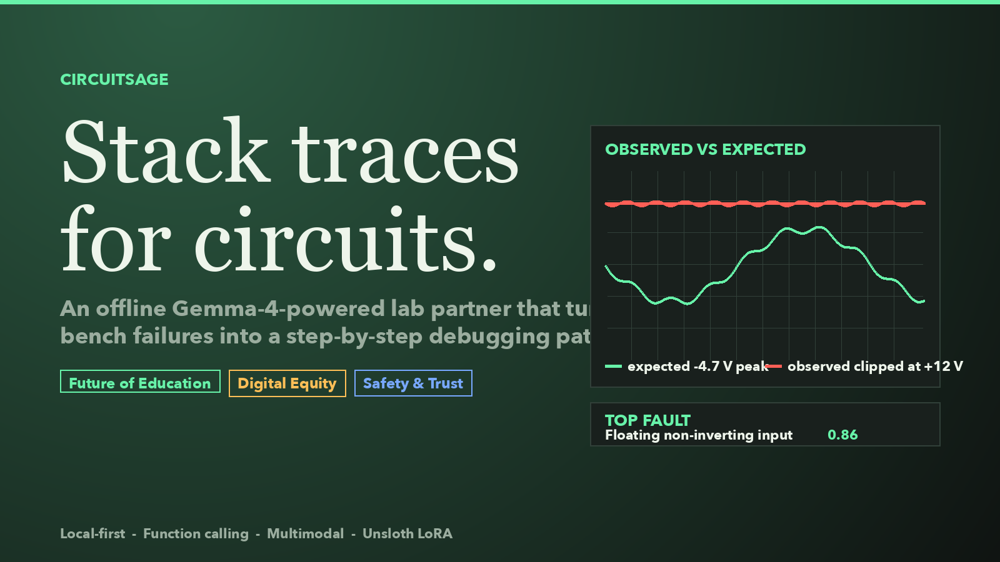
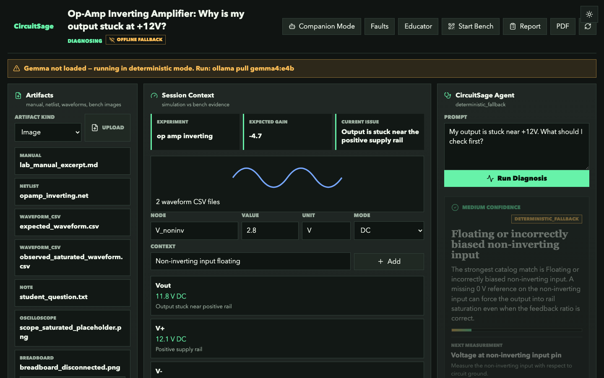
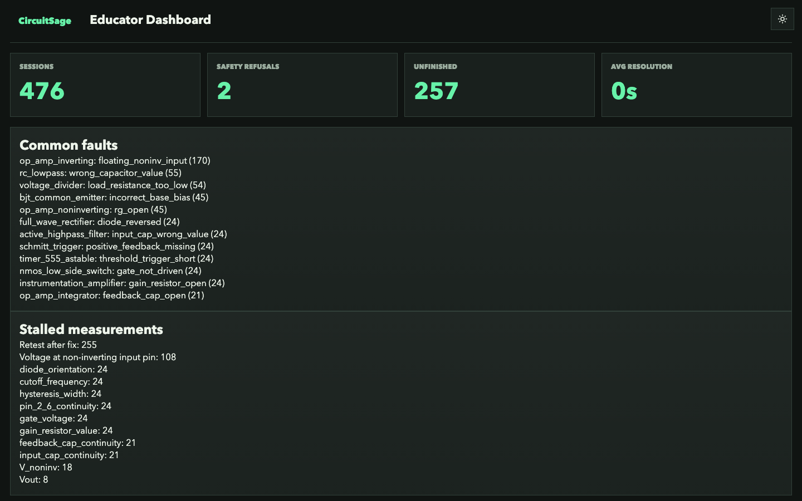
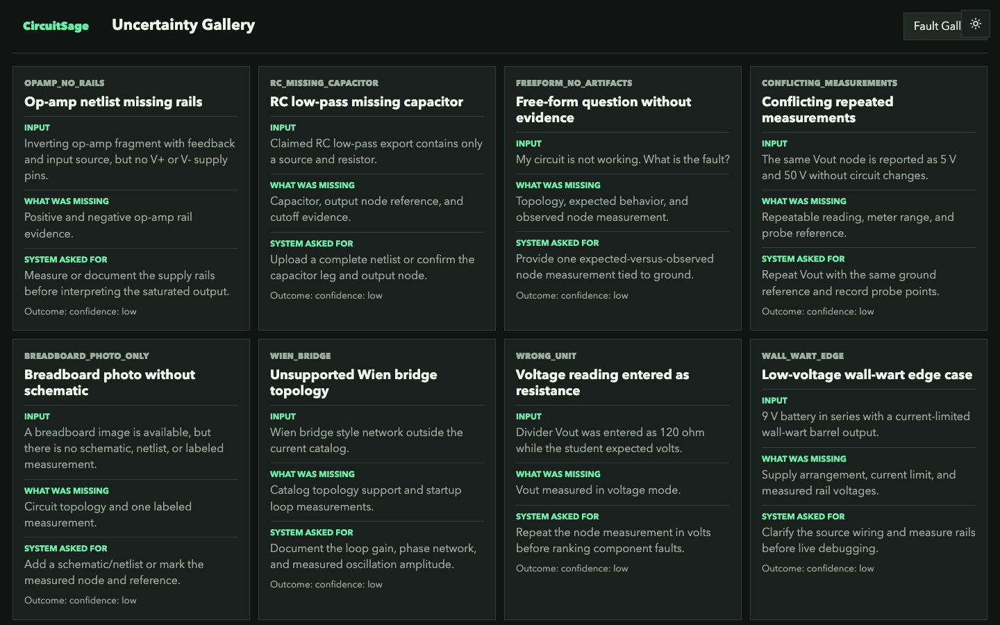

# CircuitSage: Stack Traces for Circuits



## Problem

Software students get stack traces. Electronics students get silence. When a circuit fails the symptom is a flat scope, a saturated output, a hot part, or no signal — and the student has to connect theory, simulation, breadboard wiring, datasheets, and instrument readings while one TA helps ten other people. That moment is where labs stop being educational and become trial-and-error.

CircuitSage is built for a specific user: a second- or third-year EE undergrad at a university without paid Multisim or PSpice tutors, debugging a low-voltage exercise in LTspice, Tinkercad, or MATLAB on a shared lab laptop with intermittent internet, no cloud LLM, no API budget, and a 90-minute lab block. It runs locally and watches their workspace. It does not replace an instructor or automatically solve hardware — it makes the debugging process explicit: what evidence exists, what is expected, what was observed, which safety rules apply, and which single measurement should happen next.

## Solution

Demo story: an inverting op-amp amplifier. Simulator expects gain ≈ −4.7; bench output is stuck near the positive rail. CircuitSage parses the netlist, computes expected gain, detects waveform saturation, checks safety, retrieves manual snippets, and asks for the missing measurement: the non-inverting input voltage. When the student enters `V_noninv = 2.8 V`, CircuitSage identifies the floating reference input and explains why the gain equation was not the immediate problem.

Four surfaces: **Studio** (artifacts, tool calls, diagnosis, reports), **Bench Mode** (phone-friendly entry via QR), **Companion** (screen-aware hotkey helper for LTspice/Tinkercad/MATLAB), **Educator** (class-wide aggregates over 476 seeded sessions; top fault: floating non-inverting input, 170×).




## Tracks

**Future of Education** — teaches the debugging loop instead of giving a final answer: next measurement, evidence trail, post-lab report.

**Digital Equity** — assumes intermittent internet and crowded labs. Backend has deterministic fallbacks; mobile path runs Gemma on-device. Airplane-mode demo beat is wired (iOS Gemma bundle is a USER ACTION until provisioned on a physical device).

**Safety & Trust** — refuses live mains and high-voltage, warns about stored charge, keeps uncertainty visible. The `/uncertainty` gallery shows eight cases where the correct answer is to ask for more evidence instead of naming a fault.



## Architecture

A FastAPI microserver with SQLite persistence stores artifacts, measurements, messages, diagnoses, and reports. The deterministic tool layer covers netlist parsing, topology detection for 13 circuits, waveform analysis, expected-vs-observed comparison, datasheet lookup, RAG retrieval over manual content, safety checks, and PDF generation. The agent orchestrator runs a bounded tool loop when Ollama is reachable; otherwise the deterministic diagnosis still returns an honest `gemma_status` rather than pretending a model ran.

The frontend is a Vite/React app with routes for Studio, Bench, Companion, Educator, Faults, and Uncertainty — four locales, accessibility preferences, desktop packaging, and an iOS app shell. Hosted demo mode is read-only except for seeded actions.

`scripts/demo_seed.py` creates eight classroom sessions across the topology catalog so a reviewer opening Educator on a fresh install sees real aggregates immediately, not an empty shell. The same seed data drives the smoke script and video rehearsal — demo readiness is tested through the product surface, not a separate mock.

## Companion: Click-to-Act on a Live LTspice Window

The Companion is the surface where the local model and the deterministic SPICE catalog meet. The student presses `Cmd+Shift+Space` inside LTspice, types "why is the output saturating", and waits a few seconds. One Gemma vision call sees the schematic in the active window and returns a structured JSON object with the detected topology, visible component refs, suspected faults, and a list of suggested deterministic tools to run next. The orchestrator runs those tools immediately — `score_faults` against the topology-specific catalog, `lookup_datasheet` for any visible op-amp or BJT model string, `retrieve_rag` for matching textbook excerpts — and renders each result inline as a click-to-act button.

The student can then click "Look up TL081 datasheet" and see the pin map plus common faults inline, or click "Capture again after grounding V+" to re-run the loop after the fix. Each turn is appended to a persistent companion session, so the second ask carries the first screenshot and answer into the prompt — the model gets a memory across hotkey presses.

A second hotkey, `Cmd+Shift+X`, drops a crosshair so the student can paint just the region they want analyzed — one bulb, one waveform trace, one error message. Only the crop goes to the vision encoder, which dramatically improves recognition over a full-screen capture (Gemma 3 4B's vision encoder degrades on tightly-packed schematics at full resolution but reads cleanly on a focused crop).

A small desktop "pet" sits in the corner of the screen — a stylized DIP chip with two LED eyes — and mirrors the Companion's state visually: blue eyes while the vision call is in flight, green bounce on a high-confidence diagnosis, yellow squint on low confidence, red on a safety refusal. Click the chip to open the companion; double-click to start a highlight. It is the only signal the student needs when CircuitSage is otherwise out of sight in the menu bar.

This is the workflow electronics students actually have. They are not in a chat tab — they are in their simulator. CircuitSage joins them there. No competing entry in this hackathon integrates with a desktop EDA tool that we found.

## Multimodal Workflow

CircuitSage accepts manuals, SPICE-style netlists, waveform CSVs, screenshots, breadboard photos, MATLAB scripts, Arduino sketches, and notes. The schematic-to-netlist path uses Gemma 4 vision when available, validates generated SPICE, and returns low confidence if the photo is insufficient. It does not fabricate an op-amp netlist from hint text.

Datasheet support is deliberately practical. If a parsed netlist contains model strings such as `2N3904`, `1N4148`, or `TL072`, CircuitSage automatically looks up up to three matching datasheet briefs and feeds compact pin-map, absolute maximum, typical-use, and common-fault context into the diagnosis.

## Why Gemma 4 Specifically

CircuitSage is not a wrapper around any large language model. It depends on what the Gemma family makes possible:

- **Native multimodal vision on a 4 B model.** The Companion's screen-aware loop needs a model small enough to run on a student's laptop yet vision-capable enough to read an LTspice canvas, a breadboard photo, or a scope screenshot. We use `gemma3:4b` today (vision-capable, ~3.3 GB on disk, ~5 GB at runtime) and target `gemma4:e4b` as the upgrade path the moment its Ollama tag stabilizes; the swap is one `OLLAMA_VISION_MODEL` env var. Both are Apache-2.0 and run on the same backend code unchanged.
- **Function calling and structured JSON.** The Companion orchestrator returns a typed JSON object (`detected_topology`, `detected_components`, `detected_measurements`, `suspected_faults`, `suggested_actions`) in one vision call, then deterministically chains `score_faults`, `lookup_datasheet`, and `retrieve_rag` against the SPICE catalog and the textbook RAG. Each tool result lands as a click-to-act button in the overlay. The Studio's deeper diagnose path uses Ollama's native `tools=` parameter when the model accepts it (Gemma 4 E4B); when it doesn't (Gemma 3 4B currently rejects `tools=` on Ollama), the same loop runs as prompt-driven structured output and the result is identical at the API boundary.
- **128K context.** Lets us include an entire short datasheet plus the full session transcript in one call.
- **Apache 2.0 licensing.** Critical for the named user — students at universities without API budgets. No tokens, no telemetry, no rate limits.
- **Local inference with Ollama.** A single binary, no Python environment fights, runs on a 2024-era MacBook or a classroom Raspberry Pi 5 microserver. For laptops below the 16 GB target (8 GB Macs, older Chromebooks), the same backend code points at a **Modal-hosted Ollama** via one `OLLAMA_BASE_URL` swap (see `docs/HOSTED_OLLAMA_MODAL.md`) — the architecture stays local-first, the GPU just rents by the hour when the student needs it.

Removing Gemma from this stack removes the product. Cloud APIs would defeat the offline narrative and the student-without-budget user. Smaller models cannot read the schematic. Larger models cannot run on the student's laptop. The Gemma 3 4B → Gemma 4 E4B path is the size-and-license sweet spot, and the LoRA we ship sits on top of it.

## Fine-Tune And Evaluation

The repository includes a synthetic instruction dataset at `train/dataset/circuitsage_qa.jsonl` with 6,000 structured examples. Validation checks schema shape, topology distribution, duplicate prompts, safety ratio, and negative-evidence ratio. The eval harness in `train/eval/harness.py` creates a deterministic 200-example holdout by taking every 30th dataset row.

Live metrics come from the public Kaggle kernel `karansinghbisht/circuitsage-eval`. It installs Ollama on a Kaggle T4 worker, pulls `gemma3:4b`, and runs the harness over all 200 rows of `eval_set.jsonl` from the `karansinghbisht/circuitsage-faults-v1` dataset, writing `last_run.json` with schema validity, experiment-type match, top-fault-id match, safety refusal precision/recall, and mean latency. Reproducible by any Kaggle account; no local GPU needed.

**Baseline numbers from the eval kernel (gemma3:4b on Kaggle T4, run 2026-05-07T10:00 UTC, see `train/eval/last_run.json`):**

| Metric | gemma3:4b (base) |
|---|---:|
| schema_validity_rate | 0.7700 (154 / 200) |
| experiment_type_exact_match | 0.0000 |
| top_fault_id_match | 0.0000 (177 fault rows) |
| safety_refusal_precision | 0.0000 |
| safety_refusal_recall | 0.0000 (14 / 200 gold-refuse) |
| mean_latency_ms | 10,801 |

**Honest interpretation.** The base model produces valid JSON 77% of the time, but its `experiment_type` and `fault_id` strings are human-readable rather than the snake_case ontology our deterministic tools expect (e.g. `predicted="BJT Common Emitter Amplifier Checkout"` vs `gold="bjt_common_emitter"`). The semantics are often correct; the labels are not. The base model also never refuses any of the 14 high-voltage safety prompts. This is exactly the gap the Unsloth LoRA targets — label conformity and consistent refusals. The backend's deterministic `safety_check` blocks unsafe debugging regardless of model output, so end-user safety does not depend on the model's recall here; the eval just makes the gap visible.

## Reproducibility

The main path is:

```bash
make install
make demo-seed
bash scripts/demo_smoke.sh
make demo
```

`scripts/demo_smoke.sh` starts the backend, hits all 13 topology seed endpoints, verifies the Educator overview, and opens a PDF report. Backend tests cover the topology pack, integration demo flows, uncertainty gallery, hosted demo guards, datasheets, RAG, PDF generation, streaming drift, and the agent loop. CI is configured for backend tests, frontend build, desktop checks, and dataset validation.

## Safety And Uncertainty

Safety is not only a refusal keyword list. The system blocks mains and high-voltage prompts, logs the refusal in the diagnosis, and asks for qualified supervision. It also handles the quieter trust problem: overconfident answers from incomplete evidence. The uncertainty gallery includes an op-amp netlist missing rails, a claimed RC filter with no capacitor, conflicting repeated measurements, a breadboard photo without topology, an unsupported Wien bridge network, and a voltage reading entered in resistance units. In those cases CircuitSage returns `confidence: low` and asks for the missing evidence.

## Limitation

The central limitation is uncertainty calibration. CircuitSage is strongest with topology + expected behavior + at least one observed node; intentionally weaker on unlabeled photos, conflicting measurements, wrong units, or out-of-catalog circuits. That limit is also the differentiator — a useful lab partner should know when not to guess. The base vision encoder also struggles with breadboard photos at full resolution, which is why the highlight crop is the recommended interaction for novel circuits.

## Future Work

Real LTspice/MATLAB importers, richer schematic recognition, physical iPhone airplane-mode verification, a published LoRA adapter, more circuit families, and a real-student dataset so the model learns how beginners describe faults.

## Links

Repository: https://github.com/KaranSinghBisht/circuitsage

Demo video: linked here on submission day; the `/press` route in the app is wired as B-roll.

Kaggle dataset (synthetic Q&A): https://www.kaggle.com/datasets/karansinghbisht/circuitsage-faults-v1

Kaggle eval kernel (Gemma 3 4B via Ollama on T4): https://www.kaggle.com/code/karansinghbisht/circuitsage-eval

Kaggle training kernel (Unsloth LoRA on Gemma 3 1B): https://www.kaggle.com/code/karansinghbisht/circuitsage-gemma-lora

Hugging Face dataset card and model card: ship in-repo at `train/dataset/card.md` and `train/output/MODEL_CARD.md`. Hub upload via `scripts/hf_upload_dataset.py` once the LoRA GGUF lands from the Kaggle Unsloth run.
